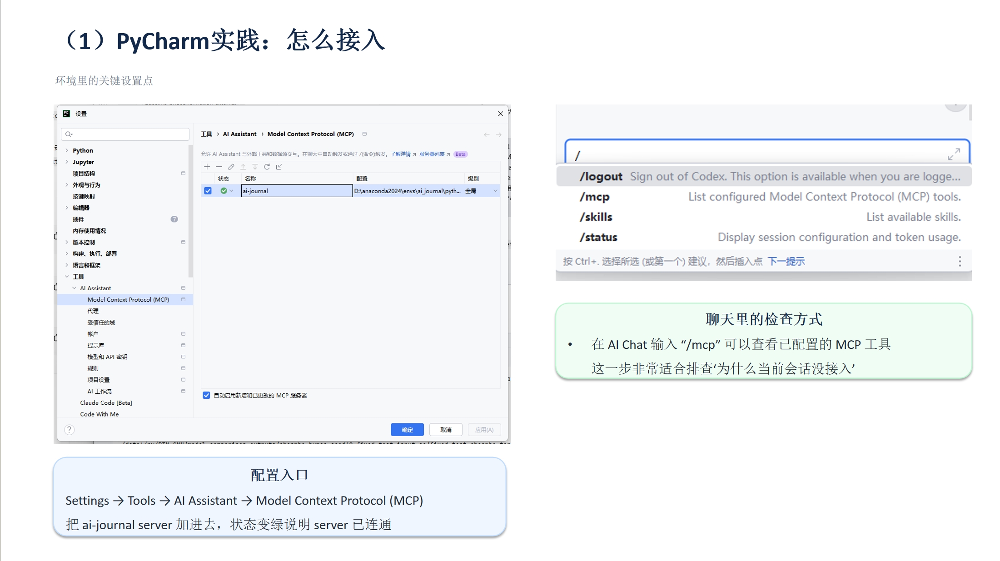
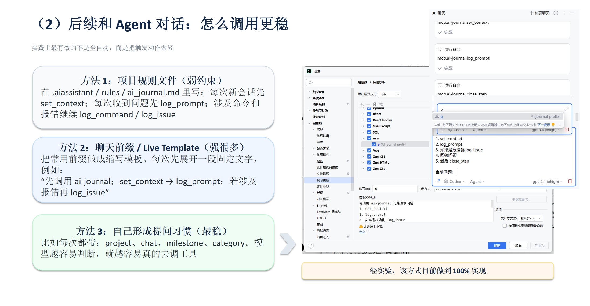

# Agent Dashboard

A desktop widget for monitoring MCP Agent work logs.

一个用于监控和展示 MCP Agent 工作日志的桌面悬浮组件。

## Screenshots




## 功能特性

- 🖥️ 桌面悬浮图标，可拖拽，可调整大小
- 📊 实时监控项目日志变化
- 📅 今日/昨日/7天汇总三种视图
- 📝 显示项目目的、方法、文件变更、问题统计
- 🔍 点击查看详细信息
- 📂 快速打开日志文件和目录
- 🔄 自动刷新，无需手动操作
- 🎨 Catppuccin Mocha 配色主题

## 项目结构

```
agent-dashboard/
├── dashboard/             # UI 组件
│   ├── parser.py         # 日志解析器
│   ├── watcher.py        # 文件监听器
│   └── ui/               # UI 组件
│       ├── main_widget.py    # 主窗口和悬浮图标
│       ├── detail_dialog.py  # 详情对话框
│       ├── today_widget.py   # 今日视图
│       ├── yesterday_widget.py  # 昨日视图
│       └── summary_widget.py    # 7天汇总视图
├── screenshots/          # 截图
├── app.py               # 主程序入口
├── requirements.txt     # Python 依赖
└── config.json         # 配置文件
```

## 安装

```bash
pip install -r requirements.txt
```

## 使用

### 启动桌面组件

```bash
python app.py
```

桌面会出现一个📓图标，点击展开主面板。

### 配置日志路径

编辑 `config.json` 设置日志存储路径：

```json
{
  "store_path": "D:/ai_journal/store",
  "window_opacity": 0.95,
  "auto_refresh": true,
  "refresh_interval": 2
}
```

## 开发

- Python 3.8+
- PySide6
- watchdog

## License

MIT